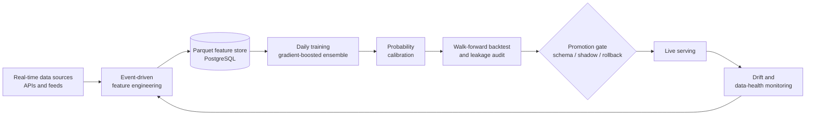

# ML Engineering Portfolio — Kyle Reynolds

Production-minded machine learning: the techniques that decide whether a model
that looks good offline actually holds up live. Each demo below is small,
self-contained, runs on synthetic/public data, and reproduces a figure. These
are the same methods I rely on operating an end-to-end production ML system
([about](#about)).

**Focus areas:** leakage-safe validation · probability calibration · SHAP-driven
feature selection · gradient-boosted ensembles · reproducible ML pipelines.

---

## Production pipeline (architecture)

The pattern behind the demos — how the pieces fit in a real, continuously
retrained system:



---

## 1 · Leakage-safe time-series validation

Random K-fold cross-validation quietly leaks future information on time-ordered
data: shuffling puts samples from every period into training, so the model is
scored on conditions it has already seen. Walk-forward validation always trains
on the past and tests on the future — the way the model is actually deployed.

On data with a regime switch (the signal moves from one feature to another over
time), random K-fold reports a higher, over-optimistic score:

| Validation scheme | ROC AUC |
|---|---|
| Random K-fold (shuffled) | **0.814** |
| Walk-forward (time-aware) | **0.788** |
| **Optimism from leakage** | **+0.026** |


→ [`src/walk_forward_validation.py`](src/walk_forward_validation.py)

---

## 2 · Probability calibration

A model can rank well yet output untrustworthy probabilities — when it says 0.9
it may be right only 70% of the time. Isotonic calibration on a held-out set
fixes the probability *scale* without changing the ranking (AUC unchanged),
improving the Brier score:

| Metric | Uncalibrated | Isotonic-calibrated |
|---|---|---|
| Brier score (lower is better) | 0.0697 | **0.0625** |
| ROC AUC | 0.962 | 0.962 |


→ [`src/probability_calibration.py`](src/probability_calibration.py)

---

## 3 · SHAP-driven feature selection

High-dimensional models carry redundant and noise features that add variance
without signal. Ranking features by mean absolute SHAP value and keeping only
the top-k preserves performance while shrinking the model **4×**:

| Features kept | ROC AUC |
|---|---|
| Top 8 | 0.962 |
| Top 10 | 0.976 |
| **All 40** | 0.975 |


→ [`src/shap_feature_selection.py`](src/shap_feature_selection.py)

---

## Run it

```bash
pip install -r requirements.txt
python src/walk_forward_validation.py
python src/probability_calibration.py
python src/shap_feature_selection.py
```

Each script prints its metrics and writes its figure to `images/`. Results are
deterministic (fixed seeds).

## About

I'm a self-taught machine learning engineer who designed and operates an
end-to-end production ML system — real-time ingestion, large-scale feature
engineering, GPU-accelerated gradient-boosted ensembles, calibration,
walk-forward backtesting, and automated daily retraining with monitoring and
rollback. This repository distills the core methods into small, reproducible
examples.

**Stack:** Python · scikit-learn · XGBoost · SHAP · pandas · NumPy · matplotlib

📫 kyleandgeorgi@gmail.com
