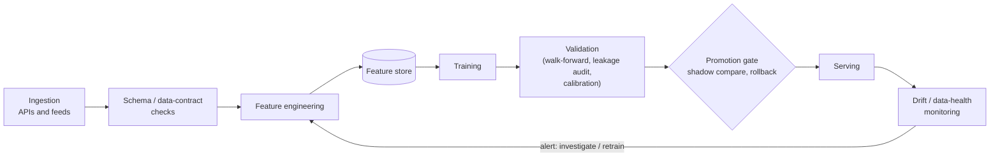
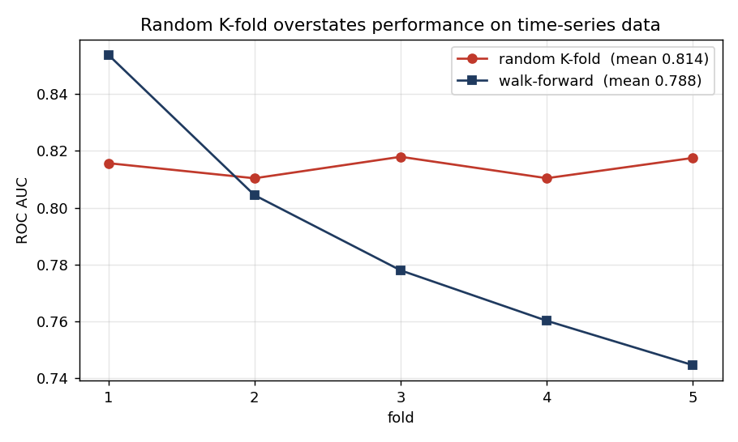
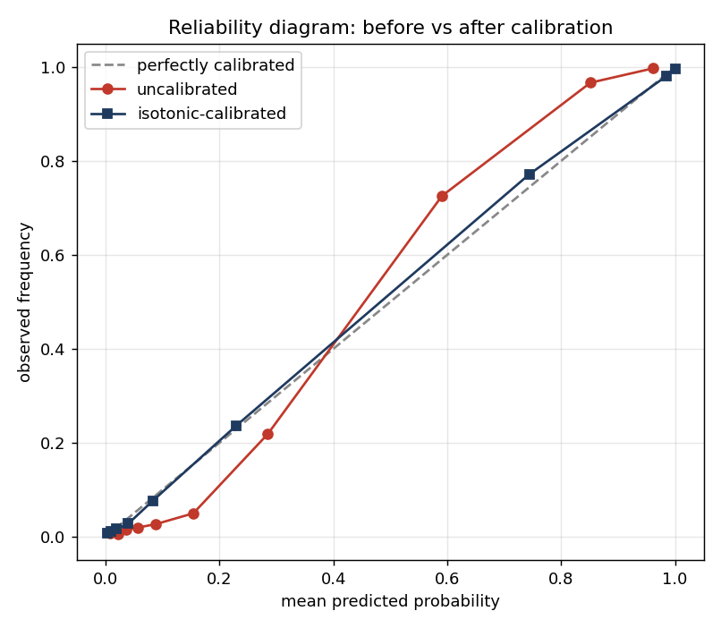
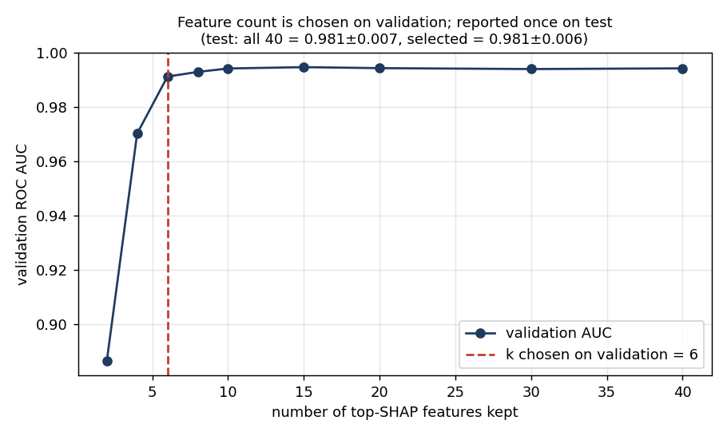
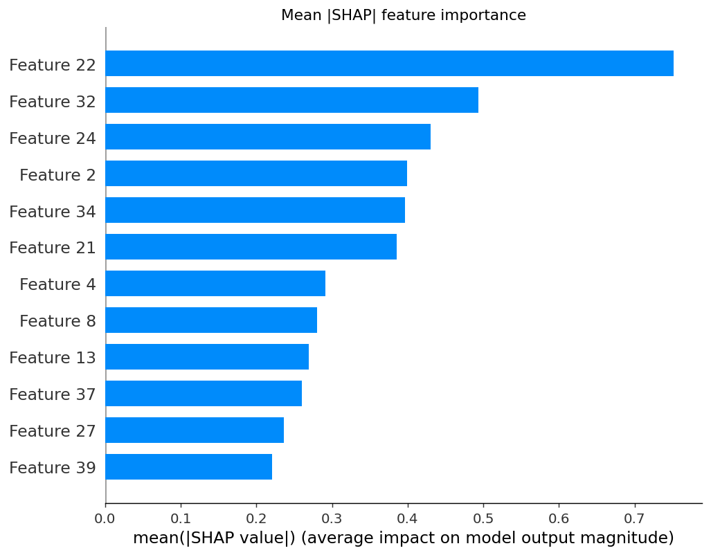
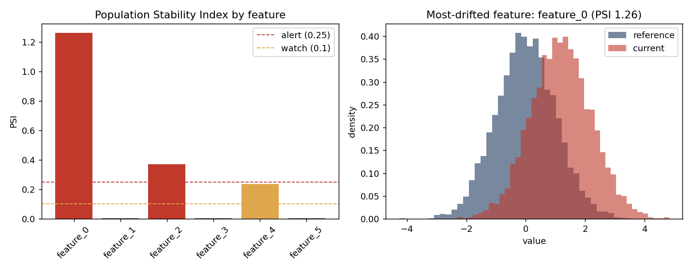
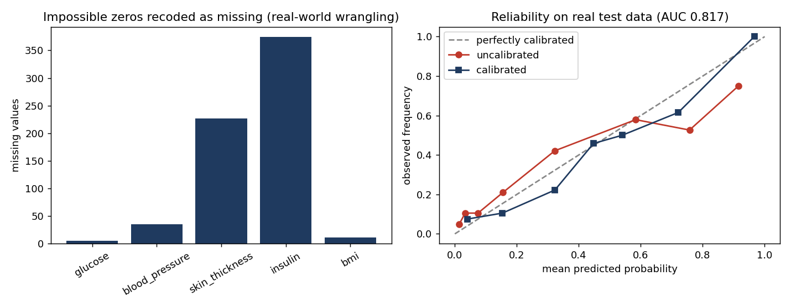

# ML Engineering Portfolio — Kyle Reynolds


A small **methods toolkit** for the production-ML concerns that decide whether a model that
looks good offline actually holds up live: leakage-safe validation, probability calibration,
honest feature selection, and drift monitoring. Every demo is self-contained, deterministic, and
its **headline claim is enforced by a test in CI** — measured out-of-sample, reported as mean ±
std across seeds, not a single lucky number.

> Scope note: four demos isolate a single concept on **synthetic benchmarks**; one runs
> end-to-end on a **messy real public dataset**; and a **fail-fast FastAPI service** serves one
> immutable, checksummed model artifact (with a Docker build + live endpoint smoke test in CI).

## Contents
- [Production pipeline (reference architecture)](#production-pipeline-reference-architecture)
- [1 · Leakage-safe time-series validation](#1--leakage-safe-time-series-validation)
- [2 · Probability calibration](#2--probability-calibration)
- [3 · SHAP-driven feature selection](#3--shap-driven-feature-selection)
- [4 · Feature drift detection](#4--feature-drift-detection)
- [5 · Real-data pipeline](#5--real-data-pipeline-messy-public-data)
- [Notebook walkthrough](#notebook-walkthrough) · [Run it](#run-it)

---

## Production pipeline (reference architecture)



A **reference** architecture. This repo implements the validation, calibration,
drift-monitoring, and serving boxes (plus a versioned artifact store); the
shadow-comparison / rollback promotion gate is shown for context and is **not** implemented here.

---

## 1 · Leakage-safe time-series validation

How you split time-ordered data changes the estimate you get. This is a **controlled**
comparison — both models train on the **same number of rows (W)**, so the only difference is
*which* rows are allowed:

- **time-respecting** — the W rows immediately *before* each test block (deployment-realistic).
- **leakage** — W rows from the test block's own era, *including future-adjacent rows*.

Under smooth linear drift, peeking at the test era inflates the score. Reported across 10 seeds:

| Training rows (matched size W) | ROC AUC |
|---|---|
| Leakage (test-era + future) | **0.852 ± 0.005** |
| Time-respecting (past only) | **0.840 ± 0.005** |
| **Temporal-validation optimism** | **+0.012 ± 0.002** |

A small but robust effect — and it's isolated to *row selection*, not training-set size.


→ [`src/walk_forward_validation.py`](src/walk_forward_validation.py)

---

## 2 · Probability calibration

A model can rank well yet be miscalibrated. Isotonic calibration (fit on a held-out set) lowers
the Brier score; because it's monotone the ranking is *nearly* unchanged — and we **measure**
that rather than assert it. Across 5 seeds:

| Metric | Uncalibrated | Isotonic-calibrated |
|---|---|---|
| Brier (lower better) | 0.0503 ± 0.0034 | **0.0454 ± 0.0032** |
| ROC AUC | 0.9779 | 0.9774 |

AUC change: mean **−0.0005**, max single-seed **0.0011** — small, real, and not zero (isotonic
ties can nudge ranking). A test asserts `|Δauc| < 0.005`.


→ [`src/probability_calibration.py`](src/probability_calibration.py)

---

## 3 · SHAP-driven feature selection

Selecting features *and the count k* is a decision — made on the **validation** set, never the
test set. Protocol: fit on **train**, rank by mean |SHAP| and choose k on **validation**, report
once on an **untouched test** set, repeated across 10 seeds:

| Feature set | Test ROC AUC |
|---|---|
| All 40 features | 0.981 ± 0.007 |
| Validation-selected (median **k = 10**) | **0.981 ± 0.006** |

The selected ~10 features **match the full 40-feature model on held-out test data within noise**
— ~4× fewer *input features* (not a claim about model size or inference cost).



→ [`src/shap_feature_selection.py`](src/shap_feature_selection.py)

---

## 4 · Feature drift detection

When live data drifts from training data a model can silently degrade. Population Stability
Index (PSI) and the Kolmogorov–Smirnov test flag *which* features shifted:

| Feature | PSI | Status |
|---|---|---|
| feature_0 (mean shift) | 1.26 | **alert** |
| feature_2 (scale change) | 0.37 | **alert** |
| feature_4 (moderate shift) | 0.24 | watch |
| stable features | < 0.01 | ok |

Caveats kept honest: PSI's 0.1 / 0.25 bands are **heuristics, not laws**; the KS **p-value** is
sample-size-driven (≈0 for any real shift at large n) and needs multiple-testing correction, so
the demo also reports the KS **D-statistic** (an effect size). And **input drift is an
early-warning signal, not proof of model degradation** — it triggers investigation/retraining,
it doesn't by itself mean accuracy dropped.


→ [`src/drift_detection.py`](src/drift_detection.py)

---

## 5 · Real-data pipeline (messy public data)

Synthetic demos isolate one idea; real data is where the wrangling lives. On the **Pima Indians
Diabetes** dataset (UCI / OpenML), several columns record physiologically-impossible **zeros**
that are really *missing* (insulin = 0, blood pressure = 0, …) — a classic trap. The pipeline
recodes them, then **imputes and scales inside a `Pipeline` fit on the training split only** (so
the test set never informs its own imputation), and calibrates on validation before reporting on
an untouched test split:

| | value |
|---|---|
| Impossible-zero values recoded as missing | **652** (across 768 rows) |
| Test ROC AUC | 0.817 ± 0.030 (variability across 5 splits, not a formal CI) |
| Brier (uncalibrated → calibrated) | 0.1708 → 0.1683 |


→ [`src/real_data_pipeline.py`](src/real_data_pipeline.py) · data: [`data/pima_diabetes.csv`](data/pima_diabetes.csv)

---

## Serving (FastAPI + artifact store + Docker)

**Training is a separate release step.** The service loads one immutable, checksum-verified
artifact and **fails fast** if none exists — it never trains on the fly.

- **Train / release** — `python -m service.train` fits the calibrated end-to-end pipeline (recode
  impossible zeros → median-impute → scale → gradient boosting → **sigmoid/Platt** calibration
  (sigmoid, not isotonic, because the calibration split is small), fit on the training split only)
  and writes a versioned, SHA-256'd artifact + rich `metadata.json` lineage
  (git SHA, seed, split sizes, hyperparameters, data + artifact checksums, library/python
  versions, decision threshold, baseline vs calibrated metrics) to `models/registry/`.
- **Serve** — `uvicorn service.app:app` exposes:
  - `GET /health` (liveness) · `GET /ready` (readiness — model loaded; 503 if not)
  - `GET /model` (full lineage / metadata)
  - `POST /predict` — strict Pydantic contract (bounded, typed, `extra="forbid"`) → calibrated
    probability + the model's decision threshold; one structured JSON log line per request with a
    request id and latency.
- **Container** — non-root, serving-only locked dependencies, package installed (no `PYTHONPATH`
  hacks), model **baked at build time**: `docker build -t svc . && docker run -p 8000:8000 svc`.
  CI builds it, runs it, and curls the endpoints (including a `422` for out-of-range input).

> The model is a **demonstration** on the Pima dataset (women of Pima heritage, age 21+) — not
> medical advice. See the [model card](model_card.md) for population limits, threshold rationale,
> and fairness notes.

```python
import requests
requests.post("http://localhost:8000/predict", json={
    "pregnancies": 6, "glucose": 148, "blood_pressure": 72, "skin_thickness": 35,
    "insulin": 0, "bmi": 33.6, "diabetes_pedigree": 0.627, "age": 50,
}).json()
# -> {"probability": 0.68, "prediction": 1, "threshold": 0.5, "model_version": 1, "disclaimer": "..."}
```

---

## Notebook walkthrough
A narrative version with the four synthetic demos:
[`notebooks/portfolio_walkthrough.ipynb`](notebooks/portfolio_walkthrough.ipynb)

## Run it
```bash
pip install -r requirements.txt
pip install -e .            # install the package — no sys.path hacks
python run_all.py          # run all 5 demos, regenerate every figure

# development
pip install -r requirements-dev.txt
pytest -q                  # demo numbers + service/registry behavior are asserted
ruff check src tests && ruff format --check src tests

# serve
python -m service.train    # release step: train + register an immutable artifact
uvicorn service.app:app    # http://localhost:8000  — /health /ready /model /predict
```
Results are deterministic per seed. CI runs the tests, all demos, the notebook, and a Docker
build + live endpoint smoke test on every push.

## About
Self-taught machine learning engineer focused on production-ML methods — leakage-safe
validation, calibration, feature selection, and drift monitoring.

**Stack:** Python · scikit-learn · XGBoost · SHAP · SciPy · pandas · NumPy · matplotlib

📫 kyleandgeorgi@gmail.com · [LinkedIn](https://www.linkedin.com/in/kyle-reynolds-29865423a/)
