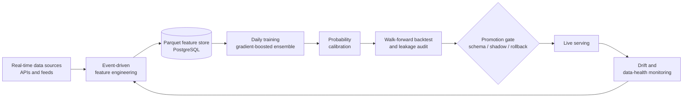

# ML Engineering Portfolio — Kyle Reynolds


Production-minded machine learning: the techniques that decide whether a model
that looks good offline actually holds up live. Every demo is small,
self-contained, deterministic, runs on synthetic data, and reproduces a figure —
and the headline result of each is enforced by a test in CI.

**Focus areas:** leakage-safe validation · probability calibration · SHAP-driven
feature selection · drift monitoring · reproducible ML pipelines.

## Contents

- [Production pipeline (architecture)](#production-pipeline-architecture)
- [1 · Leakage-safe time-series validation](#1--leakage-safe-time-series-validation)
- [2 · Probability calibration](#2--probability-calibration)
- [3 · SHAP-driven feature selection](#3--shap-driven-feature-selection)
- [4 · Feature drift detection](#4--feature-drift-detection)
- [Notebook walkthrough](#notebook-walkthrough)
- [Run it](#run-it)

---

## Production pipeline (architecture)

The pattern behind the demos — how the pieces fit in a real, continuously
retrained system:



---

## 1 · Leakage-safe time-series validation

Random K-fold cross-validation quietly leaks future information on time-ordered
data: shuffling puts samples from every period into training, so the model is
scored on conditions it has already seen. Walk-forward validation always trains
on the past and tests on the future — the way the model is actually deployed.

On data with a regime switch (the signal moves from one feature to another over
time), random K-fold reports a higher, over-optimistic score:

| Validation scheme | ROC AUC |
|---|---|
| Random K-fold (shuffled) | **0.814** |
| Walk-forward (time-aware) | **0.788** |
| **Optimism from leakage** | **+0.026** |


→ [`src/walk_forward_validation.py`](src/walk_forward_validation.py)

---

## 2 · Probability calibration

A model can rank well yet output untrustworthy probabilities — when it says 0.9
it may be right only 70% of the time. Isotonic calibration on a held-out set
fixes the probability *scale* without changing the ranking (AUC unchanged),
improving the Brier score:

| Metric | Uncalibrated | Isotonic-calibrated |
|---|---|---|
| Brier score (lower is better) | 0.0697 | **0.0625** |
| ROC AUC | 0.962 | 0.962 |


→ [`src/probability_calibration.py`](src/probability_calibration.py)

---

## 3 · SHAP-driven feature selection

High-dimensional models carry redundant and noise features that add variance
without signal. Ranking features by mean absolute SHAP value and keeping only
the top-k preserves performance while shrinking the model **4×**:

| Features kept | ROC AUC |
|---|---|
| Top 8 | 0.962 |
| Top 10 | 0.976 |
| **All 40** | 0.975 |


→ [`src/shap_feature_selection.py`](src/shap_feature_selection.py)

---

## 4 · Feature drift detection

A deployed model silently degrades when the live data distribution drifts from
training. Population Stability Index (PSI) and the Kolmogorov–Smirnov test flag
*which* features have shifted — here a mean shift and a scale change trip the
alert threshold, while the stable features stay near zero:

| Feature | PSI | Status |
|---|---|---|
| feature_0 (mean shift) | 1.26 | **alert** |
| feature_2 (scale change) | 0.37 | **alert** |
| feature_4 (moderate shift) | 0.24 | watch |
| stable features | < 0.01 | ok |


→ [`src/drift_detection.py`](src/drift_detection.py)

---

## Notebook walkthrough

A narrative version with all four demos and inline results:
[`notebooks/portfolio_walkthrough.ipynb`](notebooks/portfolio_walkthrough.ipynb)

## Run it

```bash
pip install -r requirements.txt
python run_all.py          # run all four demos, regenerate every figure

# development
pip install -r requirements-dev.txt
pytest -q                  # each demo's headline result is asserted here
ruff check src tests
```

Results are deterministic (fixed seeds); CI runs the tests and all demos on every
push.

## About

I'm a self-taught machine learning engineer who designed and operates an
end-to-end production ML system — real-time ingestion, large-scale feature
engineering, GPU-accelerated gradient-boosted ensembles, calibration,
walk-forward backtesting, and automated daily retraining with monitoring and
rollback. This repository distills the core methods into small, reproducible
examples.

**Stack:** Python · scikit-learn · XGBoost · SHAP · SciPy · pandas · NumPy · matplotlib

📫 kyleandgeorgi@gmail.com · [LinkedIn](https://www.linkedin.com/in/kyle-reynolds-29865423a/)
